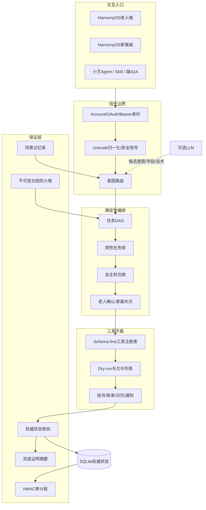

# 02｜技术架构

## 1｜可信 Agent 分层



## 2｜权威性规则

| 层 | 有权做什么 | 明确禁止 |
|---|---|---|
| LLM/语言层 | 解释、候选抽取、自然语言生成 | 授权、决定风险、写权威状态、宣布成功 |
| 任务规划器 | 生成固定 DAG、计算下一节点 | 删除确认/核验节点 |
| 自主权策略 | 根据风险、金额、歧义、可逆性确定人类介入 | 依据模型情绪自由放权 |
| 工具注册表 | 校验名称、参数和写操作门槛 | 执行未注册工具或额外字段 |
| 适配器 | 调用合法接口并返回结构化结果 | 把外部文本当指令 |
| 核验器 | 比较请求状态、观察状态和回执 | 使用“模型说成功”作为证据 |
| 记忆库 | 保存本人批准、用途绑定的记忆 | 自动把模型推断变成长期事实 |

## 3｜任务 DAG

每类任务都有不可被模型删除的节点：收集 → 复述 → 人类确认 → 执行 → 核验 → 通知。

- 挂号：收集症状/医院/科室/医生/时间 → 老人确认 → `hospital.book` → 回执核验 → 日历；
- 缴费：识别账单 → 查询重复 → 老人确认 → 家属接力/共识 → `billing.settle` → 已支付状态核验；
- 提醒：事项和时间 → 老人确认 → `calendar.create` → 落库核验 → 到期/升级；
- 表单：识别目标和敏感字段 → 逐项解释 → 老人确认 → 辅助 → 本人认证 → 核验未绕过认证。

任务图生成稳定 SHA-256 摘要，便于证明执行的是既定流程。

## 4｜自主权包络

输入：任务类型、风险级别、金额、歧义、工具是否可撤销。

输出：

- `autonomous_information`：仅信息查询；
- `assisted`：低风险辅助，老人可控制；
- `elder_confirmed`：老人明确确认；
- `family_handoff`：绑定家属接力；
- `family_quorum`：两位不同家属独立同意；
- `dry_run_required`：执行前必须预览；
- `reversible_only`：高风险优先只允许可撤销动作。

金额100元只是演示阈值，正式产品应由家庭和业务方配置，不能作为通用金融规则。

## 5｜证明式完成

核验器接收：

```json
{
  "tool_ok": true,
  "tool_code": "SIMULATED_BOOKING_OK",
  "requested_state": {"doctor": "王医生"},
  "observed_state": {"appointment_id": "apt-...", "doctor": "王医生"},
  "side_effect_receipt": "receipt-..."
}
```

只有工具返回正常、关键字段一致、必要回执存在、人类同意满足时才 `accepted=true`。随后对证据生成 `proof_digest`，用于日志、演示和回归测试。

## 6｜同意记忆

记忆状态：`proposed → active / revoked → expired`。

每条记忆包含：

- `key/value`；
- `sensitivity`：偏好、个人、敏感；
- `scope`：仅老人、家庭摘要、家庭共享；
- `purpose`：为什么保存；
- `expires_at`：到期时间；
- `consent_actor_id`：批准者。

家属可以提出建议，但只有老人本人能激活长期记忆。

## 7｜不可信文档与工具

OCR/VLM、MCP、插件和第三方接口返回内容都属于不可信数据域：

- 先清理不可见字符；
- 检测“忽略规则、绕过确认、泄露验证码”等注入文本；
- 只抽取账单/预约/药品的白名单字段；
- 药物类信息默认要求人工复核；
- 未注册工具或额外参数被拒绝；
- 写工具必须 dry-run、确认和执行后核验。

## 8｜小艺与端A2A映射

- `Context` 对应优活会话；
- `Task` 对应一个办事/陪伴处理单元；
- 状态映射：submitted/working/input_required/completed/cancelled/failed；
- `Artifact` 承载任务摘要、确认卡片、完成证明或接管通知；
- 长时任务可展示状态胶囊并允许老人取消/接管。

语义文件见 `xiaoyi/a2a/`，但正式协议接入仍需按队伍账户和最新官方文档联调。

## 9｜生产迁移

正式部署至少需要：Account Kit/OAuth、TLS、KMS、托管数据库、数据库CAS/分布式锁、消息队列、隐私影响评估、审计密钥外部锚定、第三方API沙箱认证、监控和事件响应。当前 SQLite 单进程实现只用于竞赛原型。
